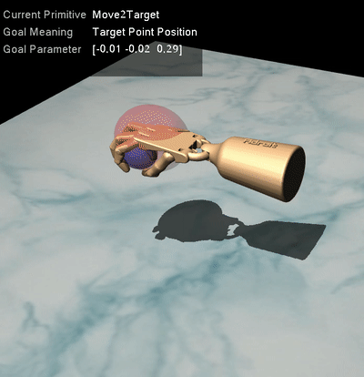

# Data Collection for LAPPLAND

This repository provides demonstration collection and simulated environments for LAPPLAND (layered action primitive planning from demonstration) project.

## Getting started

1. **Step 1:** Prepare your  environment with ```ubuntu>=16.04``` , ```python==3.6```

2. **Step 2:** Install [mujoco200](https://mujoco.org/) (mujoco210 may cause some problems). 

3. **Step 3:** Install the following extra dependencies:

    ```
    $ cd dependencies
    $ pip install -e ./gym-0.17.2
    $ pip install -e ./we_mujoco_py
    $ pip install -e ./mjrl
    $ pip install -e ./we_envs
    $ pip install -r requirements.txt
    ```
    - Note  we_mujoco_py is forked from [mujoco_py](https://github.com/openai/mujoco-py), mjrl is forked from [mjrl](https://github.com/aravindr93/mjrl).
    The original MJCF models and demonstrations are from [DAPG](https://github.com/aravindr93/hand_dapg).
    - MJCF models are available in ```dependencies/we_envs/we_envs/we_robots/assets/mj_envs```
4. **step 4:** visualize the task environments:
    
    The simulated environments are compatible with other [gym](https://github.com/openai/gym)'s environments. here's an example using the "Adroit-relocate-v6" environment:
    ```python
    import gym, we_envs
    env = gym.make('Adroit-relocate-v6')
    env.state_same_dim = True # For all envs, state dimension==39
    obs = env.reset()
    env.set_primitive_name('Approach') # set the proper action primitive
    while True:           
       action = env.action_space.sample()
       obs, reward, done, info = env.step(action)
       env.render()
    ```
    The available task environments for LAPPLAND are:
   - **Adroit-relocate-v6**

     <br/></br>

     Move the  ball to the  target point. Include three primitives: 'Approach', 'Grasp', 'Move2Target'
   - **Adroit-door-v6**

     <br/></br>

     Undo the latch and swing the door open. Include three primitives: 'DoorApproach', 'DoorGraspLatch', 'DoorOpen'
   - **Adroit-hammer-v6**

     <br/></br>

     Pick up and hammer with significant force to drive the nail into the board. Include three primitives: 'HammerApproachTool', 'HammerApproachNail', 'HammerNailGoInside'
   
    The goal-conditioned primitives are: 
    
    |  Primitive Name   | Corresponding Task|  State Dim   | Action Dim  | Goal Meaning | Label |
    |  ----  | --- | ----  | ----  | ----  | ---- |
    | Approach  | Adroit-relocate-v6 | 39 | 30 | ball position (x,y,z) |1|
    | Grasp  | Adroit-relocate-v6 | 39 | 30 | ball position (x,y,z)|2|
    | Move2Target  | Adroit-relocate-v6 | 39 | 30 | target position (x,y,z)|3|
    | DoorApproach  | Adroit-door-v6 | 39 | 28 | handle position (x,y,z)|11|
    | DoorGraspLatch  | Adroit-door-v6 | 39 | 28 | handle position (x,y,z)|12|
    | DoorOpen  | Adroit-door-v6 | 39 | 28 | handle position (x,y,z)|13|
    | HammerApproachTool  | Adroit-hammer-v6 | 39 | 26 | tool position (x,y,z)|21|
    | HammerApproachNail  | Adroit-hammer-v6 | 39 | 26 | tool position (x,y,z)|22|
    | HammerNailGoInside  | Adroit-hammer-v6 | 39 | 26 | nail position(x,y,z)|23|
    
    
## Collecting primitive demonstrations

For **Relocate** task, you can run the following command:

```
$ mpirun -np n_cpu python collect_primitives/auto_collect_relocate_primitive.py --option collect --num_episodes n_ep
```
This will collect n_cpu*n_ep primitive demos in the same directory. Demonstrations of other two tasks are also provided with similar instruction.
- The primitive demos include all environmental information of expert trajectories, displayed as follows:
    
    | Keys  | Information  |   Dimension   | 
    |  ----  | --- | ----  |
    | 'begin_env_state'  | begin state of primitive trajectory | dict | 
    | 'end_env_state'  | end state  | dict | 
    | 'goal'  | goal state | seq_len*goal_dim | 
    | 'label'  | which primitive current demo belongs to | seq_len | 
    | 'action'  | action sequence  | seq_len*act_dim | 
    | 'full_state'  | full environmental information | dict | 
    | 'state_same_dim'  | state sequence | seq_len*state_dim | 
    | 'images'  | video of primitive trajectory  | seq_len*image_dim | 
      
    for example, the state sequence of i-th primitive demonstrations can be extracted as :
        ```
        demonstrations[i]['state_same_dim']
        ``` 
## Visualizing primitives

For visualization, run the code like follows :

```
$ python collect_primitives/auto_collect_relocate_primitive.py --option visualize --primitive_name Approach
```

More information can be obtained by running the following command:

```
$ python collect_primitives/auto_collect_relocate_primitive.py --help
```

## Util functions
| Function  | Parameter  | Usage  |
|  ----  | --- | ---- |
| env.set_primitive_name | (primitive_name) | set the primitive_name for simulated env |
| env.extract_goal_from_obs_same_dim | (primitive_name, obs) | extract goal from current observation obs|
| env.reset_primtive_env | (begin_state) | reset primitive env to begin_state|
| env.set_env_state | (state_dict) | set current (task) environment state|
| env.render | (extra_info) | render simulated env, with extra_info (e.g., goal)|
| env.reset_model_initial_state_randomness | (state_randomness) | reset task env with certain initial state randomness|

    
